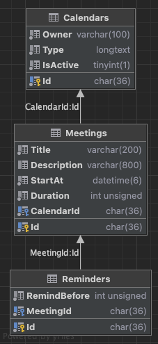

### Flexible database access with OData - integration into your ASP.NET Core WebApi
Almost every [WebApi](https://en.wikipedia.org/wiki/Web_API/) relies on the persistence of its data in a database. For the data exchange between client and WebApi (server), high requirements then apply in most cases. Uniform semantics and platform independence always have a high priority in the requirements catalog. The [Open Data Protocol](https://www.odata.org/) (OData) fulfills both requirements equally with its HTTP-based protocol. The OData protocol was originally published by [Microsoft](https://www.microsoft.com/en-us/). Software corporations such as [SAP](https://community.sap.com/topics/gateway/) use OData as a link to their applications.

This article shows you how to integrate [OData](https://docs.microsoft.com/en-us/odata/) into your [ASP.NET Core](https://docs.microsoft.com/en-us/aspnet/core/) WebApi. The main focus is on querying data from the relational database system [MySQL](https://www.mysql.com/), as well as OData's interaction with Microsoft's object database mapper [Entity Framework Core](https://docs.microsoft.com/en-us/ef/), or EF Core for short.


#### **Advantages**
Using OData gives you the following advantages:
* A flexible access to database systems, as well as data in general.
* The ability to develop applications that can be integrated across platforms and technologies.
* Well structured and easy to read semantics of the requests.
* The protocol complies with international standards according to [OASIS](https://www.oasis-open.org/) and [ISO](https://www.iso.org/).


#### **Relational reference database**
The following entity relationship diagram shows the structure of the reference database used in the following.

<p align="center">
  
</p>

The database shown could be the basis of a calendar application in which a user can manage appointments in his calendar and then provide them with reminders. The tables are connected by a 1:N relation.


#### **Getting started**
If you have [Docker](https://www.docker.com/) installed on your machine, you can run the reference database on a MySQL server inside a Docker container. Simply start the Docker Engine and then run the shell script [`run_mysql_server.sh`](./run_mysql_server.sh).

You can then use the following connection string to connect your applications to the database:

```
Server=localhost; Port=4200; Username=root; Password=pasSworD; Database=db_odata_aspnet;
```

If you have installed a MySQL database server on your computer, then you can also use this. But make sure that you have an appropriate configuration.


#### **Creating and setting up projects**
At the beginning you have to install EF Core once on your computer. Optionally you execute the shell script [`ef_install.sh`](./tools/dotnet/ef_install.sh).

Then create a suitable project structure for [Library](./src/ODataSample.Library) and [WebApi](./src/ODataSample.WebApi) components. In the [`Directory.Build.props`](./src/Directory.Build.props) file, you then add the necessary packages.

You can now create OData WebApi endpoints with ASP.NET Core. The packages give you access to the EF Core base and design-time components. Furthermore, components for relational database integration as well as [Pomelo's MySQL](https://github.com/PomeloFoundation/Pomelo.EntityFrameworkCore.MySql) database provider become available for EF Core.


#### **Implementation of the model classes**
The OData [model classes](./src/ODataSample.Library/Models) are already implemented by the EF Core entity classes `Calendar`, `Meeting` and `Reminder`.


#### **Implementation of the controller classes**
You implement the OData [controller classes](./src/ODataSample.WebApi/Controllers) in the following basic structure. Here the `CalendarController` class is shown as an example.

```csharp
// File: CalendarController.cs

using Microsoft.AspNetCore.Mvc;
using Microsoft.AspNetCore.OData.Query;
using Microsoft.AspNetCore.OData.Routing.Controllers;
using ODataSample.Library.Repositories;

namespace ODataSample.WebApi.Controllers;

[ApiController]
[Route("calendars")]
public class CalendarController : ODataController
{
    private readonly ICalendarRepository _calendarRepository;

    public CalendarController(ICalendarRepository calendarRepository)
    {
        _calendarRepository = calendarRepository;
    }

    [EnableQuery]
    [HttpGet("query")]
    public IActionResult GetQuery()
    {
        return Ok(_calendarRepository.Query);
    }

    [EnableQuery]
    [HttpGet("list")]
    public IActionResult GetList()
    {
        return Ok(_calendarRepository.List);
    }
}
```

Your controller class derives from the base class `ODataController`. The `HttpGet` methods get the `EnableQuery` attribute as a decorator. This enables the OData query options for the corresponding WebApi endpoints.

The output of data of the types `IQueryable` or `ActionResult<IQueryable>` allows to translate OData queries directly into SQL queries and to execute them on the database server. In doing so, OData combines the capabilities of [LINQ](https://docs.microsoft.com/en-us/dotnet/csharp/programming-guide/concepts/linq/) and EF Core.

When outputting data of other types like `IReadOnlyList` or `IEnumerable` the OData queries are executed in the working memory (RAM) of the application. So the data must be loaded from the database into the working memory in advance. Afterwards the OData queries can be executed in the working memory.


#### **Configuration of the OData service**
You configure the OData service before starting your application in the file [`Program.cs`](./src/ODataSample.WebApi/Program.cs). The following code block shows you a possible configuration.

```csharp
// File: Program.cs (excerpt)

var builder = WebApplication.CreateBuilder(args);

builder.Services.AddControllers()
    .AddOData(options =>
    {
        options.Select();
        options.OrderBy();
        options.Filter();
        options.Expand();
        options.SetMaxTop(100);
    });
```

The methods here enable the OData query options `$select`, `$orderby`, `$filter`, `$expand` and `$top`. The last method `SetMaxTop()` sets the maximum value of the query option `$top` that the client can request. All options are globally valid for all controller classes.

If you want to configure the controller class [`CalendarController`](./src/ODataSample.WebApi/Controllers/CalendarController.cs) individually, then you can enable query options specifically by attribute. The following code block shows you an example.

```csharp
// File: CalendarController.cs (excerpt)

[Page(MaxTop = 50, PageSize = 10)]
public class CalendarController : ODataController
{
}
```

So you can override the global configuration of `$top` with `MaxTop` and additionally limit the output of the OData query with `PageSize`.


#### **Data query**
If you have Docker installed on your machine, simply start the Docker Engine and run the shell scripts [`run_mysql_server.sh`](./run_mysql_server.sh) and [`run_webapi.sh`](./run_webapi.sh) one after the other. Make sure that the Docker container with the MySQL server is fully started before you start the WebApi afterwards.

When the application is first started, the [`DatabaseUpdater`](./src/ODataSample.Library/Database/DatabaseUpdater.cs) class inserts sample data into the database. You can open the database [Adminer](https://www.adminer.org/en/) in your browser via the URL http://localhost:4300/.

You can now test the discussed application example via [Postman](https://www.postman.com/) or [cURL](https://curl.se/). In the GitHub repository you can find a Postman [collection](./tools/postman) and some [shell scripts](./tools/curl).

You can use the following HTTP GET request to retrieve all data from the `Calendar` table.

```
https://localhost:5001/calendars/query
```

The shown request returns the following JSON in the response body.

```json
[
  {
    "id": "2000ff3d-03f8-4c50-8c03-d08465ada110",
    "owner": "Marvin",
    "type": "personal",
    "isActive": false,
    "meetings": []
  },
  {
    "id": "536dc919-445f-4feb-ae8b-7aac2f97ee3a",
    "owner": "Ford Perfect",
    "type": "work",
    "isActive": true,
    "meetings": []
  },
  {
    "id": "f10e426b-068f-41b3-83bd-66ab6f3c1378",
    "owner": "Arthur Dent",
    "type": "personal",
    "isActive": true,
    "meetings": []
  }
]
```

Since the WebApi endpoint in [`CalendarController`](./src/ODataSample.WebApi/Controllers/CalendarController.cs) outputs the data using the `IQueryable` type, the OData queries can be translated directly into SQL queries. Here the following SQL query is generated.

```sql
SELECT `c`.`Id`, `c`.`IsActive`, `c`.`Owner`, `c`.`Type`
FROM `Calendars` AS `c`
```

You can now extend the HTTP GET request shown above with the OData query options enabled. The following sections show which options are available to you.


#### **Query option [$select](./tools/curl/calendars_query_select.sh)**
The query option `$select` allows you to select data from a table. For example, you can use the following request to retrieve the `Owner` and `Type` data from the `Calendar` table.

HTTP GET request:

```
https://localhost:5001/calendars/query?$select=Owner,Type
```

JSON response body:

```json
[
  {
    "Owner": "Marvin",
    "Type": "personal"
  },
  {
    "Owner": "Ford Perfect",
    "Type": "work"
  },
  {
    "Owner": "Arthur Dent",
    "Type": "personal"
  }
]
```

SQL query:

```sql
SELECT `c`.`Owner`, `c`.`Type`, `c`.`Id`
FROM `Calendars` AS `c`;
```

The generated SQL query loads the desired data `Owner` and `Type` from the table `Calendars`. Additionally the primary key `Id` is always loaded. However, this is not output here, see JSON response body.


#### **Query option [$orderby](./tools/curl/calendars_query_orderby.sh)**
The query option `$orderby` allows sorting data in ascending and descending order. For example, the following request allows you to retrieve the `Owner` and `Type` data from the `Calendar` table and sort them in ascending order by `Owner`.

HTTP GET request:

```
https://localhost:5001/calendars/query?$select=Owner,Type&$orderby=Owner
```

JSON response body:

```json
[
  {
    "Owner": "Arthur Dent",
    "Type": "personal"
  },
  {
    "Owner": "Ford Perfect",
    "Type": "work"
  },
  {
    "Owner": "Marvin",
    "Type": "personal"
  }
]
```

SQL query:

```sql
SELECT `c`.`Owner`, `c`.`Type`, `c`.`Id`
FROM `Calendars` AS `c`
ORDER BY `c`.`Owner`;
```

The generated SQL query sorts the data `Owner` in ascending order. You can also output the data in descending order, see the shell script [`calendars_query_orderby_desc.sh`](./tools/curl/calendars_query_orderby_desc.sh).


#### **Query option [$filter](./tools/curl/calendars_query_filter.sh)**
The query option `$filter` allows you to filter data. You can use `$filter` if you want to work exclusively with data that meets a certain condition. For example, the following request allows you to query only the records from the `Calendars` table for which the `Type` condition is equal to `work`.

HTTP GET request:

```
https://localhost:5001/calendars/query?$select=Owner,Type&$filter=Type eq 'work'
```

JSON response body:

```json
[
  {
    "Owner": "Ford Perfect",
    "Type": "work"
  }
]
```

SQL query:

```sql
SELECT `c`.`Owner`, `c`.`Type`, `c`.`Id`
FROM `Calendars` AS `c`
WHERE `c`.`Type` = 'work';
```

The generated SQL query filters the data for equality using the `WHERE` clause and the `=` operator.

#### **Query option [$expand](./tools/curl/calendars_query_expand.sh)**
The query option `$expand` allows you to query data from multiple linked tables. For example, the following request allows you to retrieve records from the `Calendars` table and the `Meetings` table (1:N relationship). In addition, the condition `Type` must be equal to `work` in table `Calendars`.

HTTP GET request:

```
https://localhost:5001/calendars/query?$filter=Type eq 'work'&$expand=Meetings
```

JSON response body:

```json
[
  {
    "Meetings": [
      {
        "Id": "272858cb-895b-4a34-9eb0-2d5e3ea5abdf",
        "Title": "Lorem ipsum dolor sit amet.",
        "Description": null,
        "StartAt": "2022-09-03T17:34:48.228427",
        "Duration": 164,
        "CalendarId": "a11f7882-6060-4169-b190-8fc44b26d7a8"
      },
      {
        "Id": "f1800389-5495-432c-b388-356b32a79770",
        "Title": "Polish my friend Marvin",
        "Description": "A really sad robot",
        "StartAt": "2022-09-01T17:34:48.228422",
        "Duration": 82,
        "CalendarId": "a11f7882-6060-4169-b190-8fc44b26d7a8"
      }
    ],
    "Id": "a11f7882-6060-4169-b190-8fc44b26d7a8",
    "Owner": "Ford Perfect",
    "Type": "work",
    "IsActive": true
  }
]
```

SQL query:

```sql
SELECT `c`.`Id`, `c`.`IsActive`, `c`.`Owner`, `c`.`Type`, `m`.`Id`,
       `m`.`CalendarId`, `m`.`Description`, `m`.`Duration`, `m`.`StartAt`, `m`.`Title`
FROM `Calendars` AS `c`
LEFT JOIN `Meetings` AS `m` ON `c`.`Id` = `m`.`CalendarId`
WHERE `c`.`Type` = 'work'
ORDER BY `c`.`Id`;
```

The generated SQL query extended the data from `Calendars` with the `LEFT JOIN` clause by data from `Meetings`. In addition, here is sorted in ascending order by `Id` from `Calendars`.


#### **Query option [$top](./tools/curl/calendars_query_top.sh)**
The query option `$top` allows you to limit the number of records to be returned. If you expect to return too many records, `$top` can be very useful. For example, with the following request you can limit the output of records from the `Calendars` table to a maximum of two records.

HTTP GET request:

```
https://localhost:5001/calendars/query?$select=Owner,Type&$top=2
```

JSON response body:

```json
[
  {
    "Owner": "Ford Perfect",
    "Type": "work"
  },
  {
    "Owner": "Arthur Dent",
    "Type": "personal"
  }
]
```

SQL query:

```sql
SELECT `c`.`Owner`, `c`.`Type`, `c`.`Id`
FROM `Calendars` AS `c`
ORDER BY `c`.`Id`
LIMIT 2;
```

The generated SQL query limits the output with the `LIMIT` clause to two records. Additionally, the `ORDER BY` clause sorts in ascending order by the primary key `Id`. This way you always get the same output for this request.

If you use the query option `$top` together with `$skip`, then [pagination](https://schneide.blog/2021/06/14/pagination-in-sql/) of large records is possible. For the query option `$skip` the `OFFSET` clause is generated in your SQL query. You can find an example in this [GitHub repository](./tools/curl/calendars_query_top_skip.sh).


#### **Conclusion**
This article shows you the first steps to query structured data from your ASP.NET Core WebApi using OData. Furthermore you got a first impression how OData and EF Core interact with the relational database system MySQL.

Further steps for a productive use of OData will certainly be necessary. Mentioned here are the description of the underlying [Entity Data Model (EDM)](https://docs.microsoft.com/en-us/odata/webapi/model-builder-abstract/) and the configuration of [access rights](https://docs.microsoft.com/en-us/odata/webapi/basic-auth/) as well as [security features](https://docs.microsoft.com/en-us/odata/webapi/odata-security/).

You can find the complete code in this GitHub repository.

Happy Coding!
